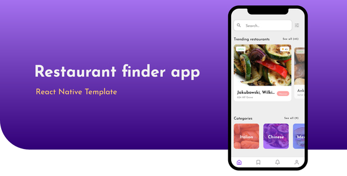

## What's inside

- 20+ screens
- Organized app structure that can be easily scaled
- Reusable components

Foodie is a React Native Theme consist of 20+ screens with all UI components you might need for your next Restaurant Application. This project does not contain any back end functionality and its purpose is to provide you with almost all Front End component to get started with your Restaurant Application.

React version: "16.9.0"  
React-native version: "0.61.2"  

Built with [react-native-paper](https://reactnativepaper.com/)

## Installation

```shell
# cd into folder project and install dependencies
cd foodie && npm install

# start react native packager
react-native start

# run the application on your phone or simulator
react-native run-android
```

## Folder structure

- `src`: This folder is the main container of all the code inside your application
    - `api`: Contains fake api data for the application
    - `assets`: Asset folder to store all images, vectors, etc
    - `components`: Contains all application components
        - `category`: All components related to the restaurant categories
        - `core`: All common reusable components (such as buttons, inputs)
        - `friends`: All user friends components 
        - `profile`: Contains user profile components
        - `restaurant`: Contains all restaurant related components
   - `constants`: This folder contains application Theme constant
   - `navigation`: Here you can find the navigation setup files
   - `screens`: This folder contains all of the application screens
   
## Core components props

### AppLogo
|Prop|Type|Required|Default|
|---|---|---|---|
|**`color`**|`string`|`No`|`#eee`|
|**`style`**|`object`|`No`|`null`|
|**`light`**|`boolean`|`No`|`true`|

### AvatarUploader
|Prop|Type|Required|Default|
|---|---|---|---|
|**`size`**|`number`|`No`|`100`|
|**`icon`**|`string`|`No`|`camera-alt`|
|**`style`**|`object`|`No`|`null`|

### BackgroundCover
|Prop|Type|Required|Default|
|---|---|---|---|
|**`screen`**|`boolean`|`No`|`false`|
|**`children`**|`ReactNode`|`No`|`null`|
|**`source`**|`object`|`Yes`|`null`|
|**`overlay`**|`string`|`No`|`null`|
|**`style`**|`object`|`No`|`null`|
|**`imageStyle`**|`object`|`No`|`null`|

### Button
|Prop|Type|Required|Default|
|---|---|---|---|
|**`buttonStyle`**|`object`|`No`|`false`|
|**`onPress`**|`function`|`No`|`null`|
|**`text`**|`string`|`Yes`|`null`|
|**`style`**|`object`|`No`|`null`|
|**`fontSize`**|`number`|`No`|`null`|

### Container
|Prop|Type|Required|Default|
|---|---|---|---|
|**`children`**|`ReactNode`|`No`|`null`|

### DistanceInputSlider
Check [`react-native-slider`](https://github.com/react-native-community/react-native-slider) props

### Input
|Prop|Type|Required|Default|
|---|---|---|---|
|**`icon`**|`string`|`Yes`|`null`|
|**`iconColor`**|`string`|`No`|`null`|
|**`style`**|`object`|`No`|`null`|
|**`inputWrapperStyle`**|`object`|`No`|`null`|